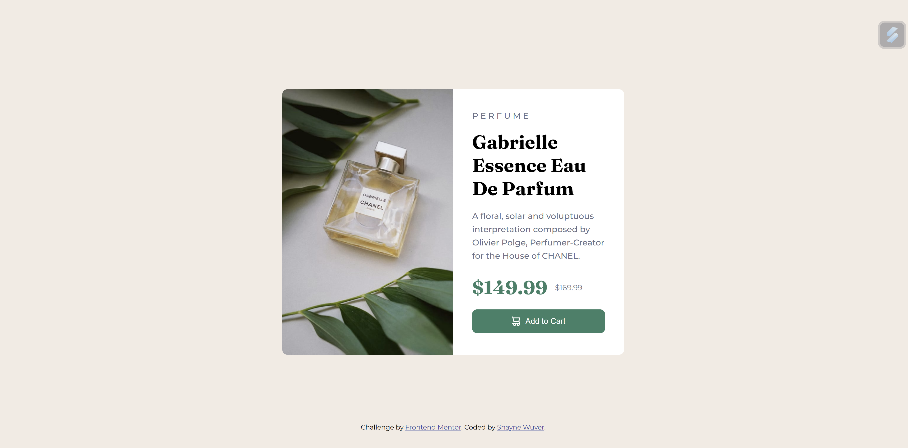

# Frontend Mentor - Social links profile solution

This is a solution to the [Product Preview Card](https://www.frontendmentor.io/learning-paths/building-responsive-layouts--z1qCXVqkD/steps/66ec78345832c087f25fde16/challenge/start).

## Table of contents

- [Overview](#overview)

  - [The challenge](#the-challenge)
  - [Screenshot](#screenshot)
  - [Links](#links)

  - [Built with](#built-with)

- [Author](#author)

## Overview

### The challenge

Users should be able to:

- See hover and focus states for all interactive elements on the page

### Screenshot

### Links

- Solution URL: [Github Code](https://github.com/WindowsM16a/whatever)
- Live Site URL: [Github Pages](https://windowsm16a.github.io/whatever/)

### Built with

- Semantic HTML5 markup
- Flexbox

## Author

- Github - [Shayne Wuver](https://github.com/WindowsM6a)
- Frontend Mentor - [@Shayne](https://www.frontendmentor.io/profile/WindowsM16a)
